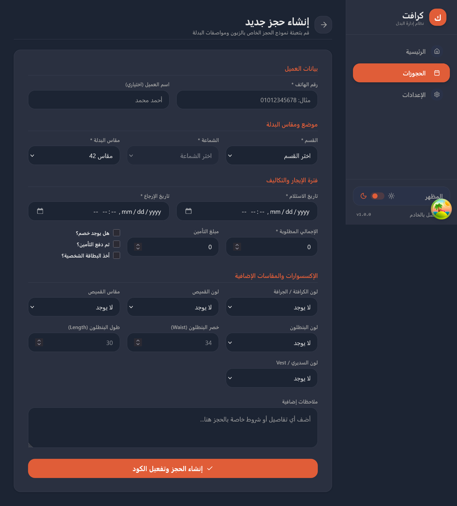

<div align="center">
  
  <h1 align="center">Antigravity Exam System</h1>
  <p align="center">
    <strong>نظام متكامل واحترافي لإدارة المقاييس والاختبارات النفسية والمهنية</strong>
    <br />
    <br />
    <a href="#المميزات-الرئيسية">المميزات</a>
    ·
    <a href="#التقنيات-المستخدمة">التقنيات</a>
    ·
    <a href="#التثبيت-والتشغيل">التشغيل</a>
  </p>
</div>

<hr />

## 🌟 نبذة عن المشروع
**Antigravity Exam System** هو منصة ويب متطورة مبنية باستخدام إطار عمل Laravel. تهدف المنصة إلى توفير بيئة متكاملة للمؤسسات والأفراد لإدارة وإجراء المقاييس والاختبارات (النفسية، المهنية، وغيرها) بمرونة عالية، مع تقديم تقارير تفصيلية ورسومات بيانية تحليلية دقيقة للمستخدمين.

## ✨ المميزات الرئيسية
### 👨‍💼 لوحة تحكم الإدارة (Admin Dashboard)
- **إدارة ديناميكية للمقاييس:** إضافة، تعديل، وحذف المقاييس بكل سهولة (اسم، وصف، صورة، مدة زمنية، سعر).
- **بناء المقاييس بمرونة:** تقسيم المقياس إلى عدة أبعاد (Dimensions) وإضافة أسئلة لكل بعد مع تحديد خيارات الإجابات وأوزانها.
- **التفسير الذكي للنتائج:** إضافة تفسيرات مخصصة لكل بعد بناءً على المستوى (مرتفع، متوسط، منخفض) وتحديد نقاط القوة وجوانب التطوير.
- **نظام الكوبونات والتخفيضات:** إنشاء كوبونات خصم أو وصول مجاني للمقاييس وتحديد عدد الاستخدامات المسموحة وتواريخ الانتهاء.
- **إحصائيات متقدمة:** واجهة رسومية توضح المبيعات، أعداد المستخدمين، المقاييس الأكثر استخداماً، وتحليلات تفصيلية للأداء.

### 👤 بوابة المستخدم (User Portal)
- **تصميم عصري (UI/UX):** واجهة مستخدم احترافية وسريعة الاستجابة على جميع الأجهزة (Mobile Friendly).
- **التخزين المؤقت الذكي (Smart Caching):** أداء فائق السرعة عبر نظام Caching يعتمد على التحديث اللحظي للبيانات.
- **إجراء المقاييس والتوقف المؤقت:** إمكانية بدء المقياس، التوقف في أي وقت، واستئناف الحل لاحقاً دون فقدان البيانات.
- **نظام الدفع والكوبونات:** شاشة منبثقة (Modal) احترافية تتيح للمستخدم إدخال كوبون مجاني أو التوجه للدفع الإلكتروني للحصول على المقياس.
- **تقارير نتائج احترافية:**
  - عرض النتيجة النهائية كنسبة مئوية مع تقييم المستوى.
  - رسم بياني شبكي (Radar Chart) ديناميكي يوضح درجات جميع الأبعاد بحلقات متدرجة.
  - تحليل مفصل لنقاط القوة والضعف (Areas of Improvement) بناءً على درجات المستخدم.

## 🛠️ التقنيات المستخدمة
- **الواجهة الخلفية (Backend):** PHP 8.x, Laravel 11.x
- **قواعد البيانات:** MySQL
- **الواجهة الأمامية (Frontend):** Blade Templates, HTML5, CSS3, Vanilla JavaScript, Bootstrap 5
- **الرسوم البيانية (Charts):** Chart.js
- **الأيقونات (Icons):** Bootstrap Icons
- **معايير الكود:** PSR-12, Laravel Pint (لضمان نظافة الكود Clean Code)

## 🚀 التثبيت والتشغيل
اتبع الخطوات التالية لتشغيل المشروع على بيئتك المحلية:

1. **استنساخ المستودع (Clone):**
   ```bash
   git clone https://github.com/Ahmedsayed732004444/Examinations-Department.git
   cd Examinations-Department
   ```

2. **تثبيت الحزم (Dependencies):**
   ```bash
   composer install
   npm install
   npm run build
   ```

3. **إعداد البيئة:**
   قم بنسخ ملف `.env.example` إلى `.env` وقم بإعداد اتصال قاعدة البيانات الخاصة بك.
   ```bash
   cp .env.example .env
   php artisan key:generate
   ```

4. **تجهيز قاعدة البيانات (Migrations & Seeding):**
   ```bash
   php artisan migrate --seed
   ```
   *(ملاحظة: يقوم الـ Seeder بإضافة بيانات تجريبية وحسابات مدير لتتمكن من تجربة النظام فوراً)*

5. **ربط مجلد الصور:**
   ```bash
   php artisan storage:link
   ```

6. **تشغيل الخادم المحلي:**
   ```bash
   php artisan serve
   ```
   يمكنك الآن زيارة الموقع عبر الرابط `http://localhost:8000`

## 🔒 الصلاحيات والوصول
- للوصول إلى لوحة الإدارة، يتم استخدام مسارات `admin/` المحمية بـ `AdminMiddleware`.
- بوابة المستخدمين تعمل عبر المسارات الأساسية محمية بـ `UserMiddleware`.

<hr />

<div align="center">
  <sub>تم تطوير هذا النظام باحترافية عالية لتقديم تجربة تقييم مميزة وسلسة.</sub>
</div>
